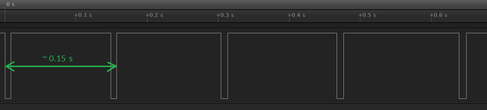
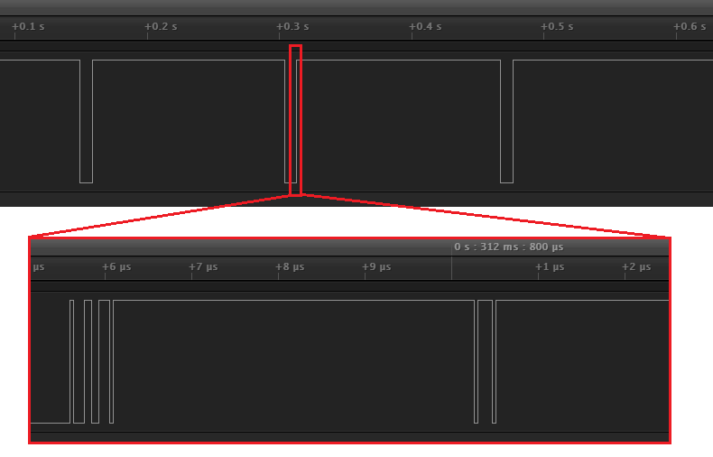

# Implementation notes
This document gives an overview of the algorithm used to measure the RPM.

Please note that the [source](mRPM/mRPM.ino) is commented quite extensively.

The installation is described in the main [readme](README.md).

## Measurement process

The software for the project is rather straightforward.
Each time the sensor sees the marker (a reflective white sticker on a black wheel, or a matte black sticker on a white wheel) it gives an interrupt.
For each interrupt, the software takes a snapshot of the time.
The difference ("delta") between two time snapshots gives the time of one revolution.
Dividing 60 by the revolution time gives RPM which is displayed on the big LED matrix.

The figure below shows the output of the sensor on a logic analyzer.

Roughly every 0.15 s the marker passes, which leads to 60/0.15 or 400 RPM.

  

## Filtering

There is one big problem though: spikes.
When we zoom in on an edge (see figure below) we see there are spikes.

  


These spikes are probably caused by the "rough" edges of the marker on the wheel.

They do, however, cause interrupts and lead to incorrect (too high) RPM values.

To mitigate this problem, the software keeps track of a moving average of the (raw) revolution times.
Any new revolution time that is far below the average is ignored, otherwise it is accepted.

The software also keeps track of a moving average of the (accepted) revolution times.
This makes the display less jumpy.

## Measurement trace
By default, the software is configured with tracing:
```
#define SEN_TRACE(...)      Serial.printf(__VA_ARGS__)
```
To disable tracing, use
```
#define SEN_TRACE(...)      // nothing
```

When tracing is enabled, the measurement process is logged (to the serial port) in all detail.
See below for an example.

```
                                         All times in us
------- ----- ---------- ------- ------- ------- -------
statenr state       time  delta1  movav1  delta2  movav2
------- ----- ---------- ------- ------- ------- -------
000/000 IDLE
001/000 STAB1    6073517
002/000 STAB     6309035  235518  235518
003/000 STAB     6486115  177080  229674
004/000 STAB     6635671  149556  221662
005/000 STAB     6767852  132181  212713
006/000 STAB     6887370  119518  203393
007/000 STAB     6997392  110022  194055
008/000 STAB     7100681  103289  184978
009/001 MEAS1    7198162   97481  176228
010/002 MEAS     7290274   92112  167816   92112   92112
011/003 MEAS     7377898   87624  159796   87624   91971
012/004 MEAS     7464686   86788  152495   86788   91809
013/005 MEAS     7557614   92928  146538   92928   91843
014/006 MEAS     7660556  102942  142178  102942   92189
015/007 MEAS     7768190  107634  138723  107634   92671
016/008 MEAS     7872858  104668  135317  104668   93045
017/008 SPIKE    7879346    6488  122434
018/009 MEAS     8000810  121464  122337  127952   94135
019/010 MEAS     8133211  132401  123343  132401   95330
020/011 MEAS     8275843  142632  125271  142632   96808
021/012 MEAS     8426276  150433  127787  150433   98483
022/012 SPIKE    8435828    9552  115963
023/013 MEAS     8618378  182550  122621  192102  101408
024/014 MEAS     8842860  224482  132807  224482  105254
025/015 MEAS     9159286  316426  151168  316426  111853
000/000 IDLE
------- ----- ---------- ------- ------- ------- -------
```

The `movav2` column contains the (averaged) revolution time in us.
As an example we take the last measured result `111853`.
A value of 111853 us or 0.111853 s means 60/0.111853 or 536 RPM.

(end of doc)
