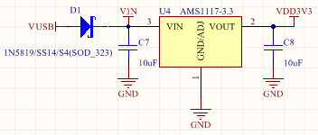
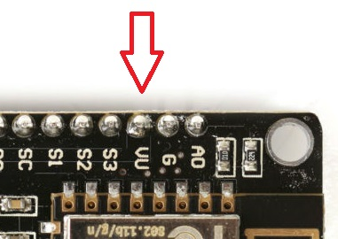
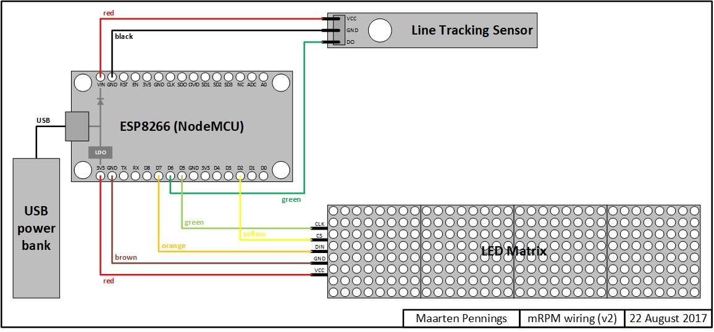
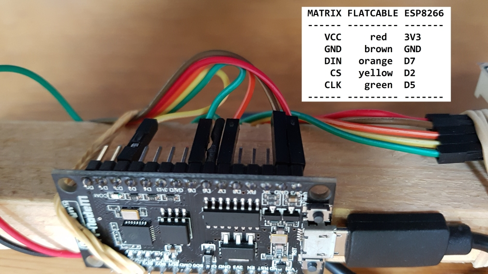
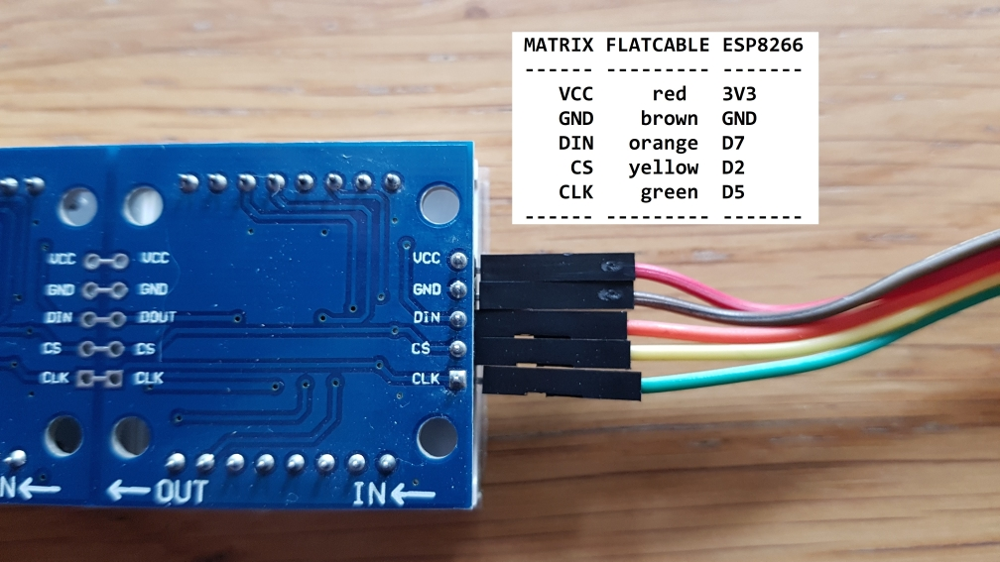
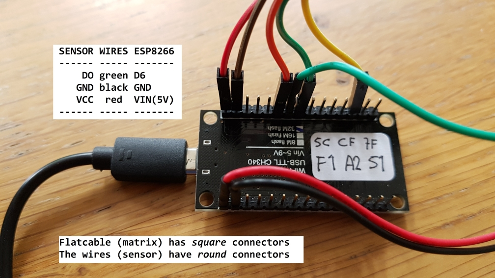
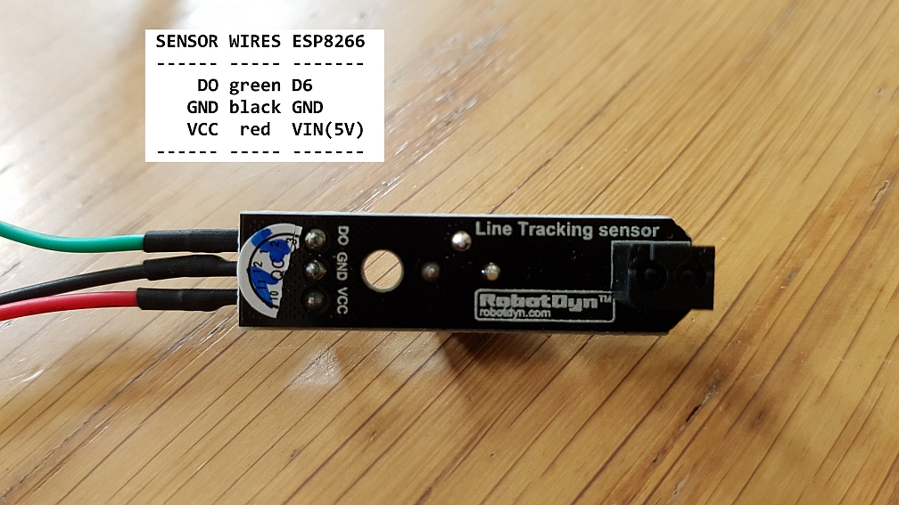
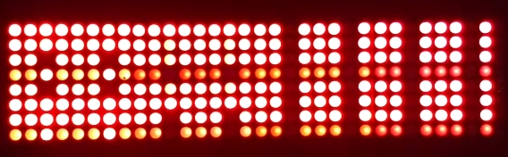
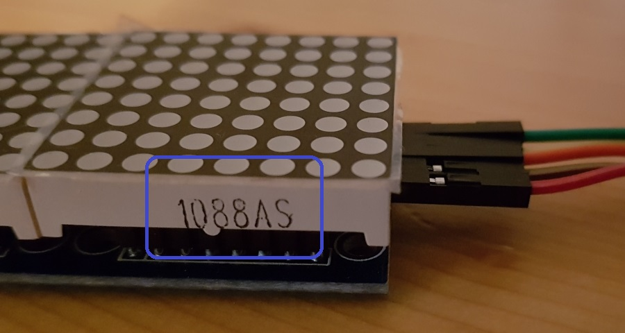

# mRPM - Wiring
The wiring of Maarten's RPM meter

## Introduction
The sensor and the matrix need to be connected to the ESP8266.
 - The _sensor_ has three pins: power (VCC 5V, GND) and a digital out (DO).
 - The _LED matrix_ is more complicated with its 5 pins; it has power (VCC 3V3, GND), data in (DIN), clock (CLK) and chip select (CS).

## Power
The ESP8266 is typically powered over USB (5V) from a power bank; the matrix and sensor are powered from the ESP8266 board.
The ESP8266 board has an LDO to convert 5V to 3V3 and it has some pins to output 3V3, one of which connects to the LED matrix.
The sensor needs 5V. Unfortunately, the chosen ESP8266 board does not have a 5V out (directly form the USB). 
It does have a VIN which is connected to VUSB via a Schottky, so we use that instead.

  

Some ESP8266 boards do have VUSB out.

  

## Schematics
The overall schematics are as follows

  

The wiring instructions are also described in a [text file](2wiring.txt).

## ESP8266 to matrix
The connection between the ESP8266 and the matrix is shown in two photos, ESP8266 side and matrix side:

  
  
  

## ESP8266 to sensor
The connection between the ESP8266 and the sensor is shown in two photos, ESP8266 side and sensor side:

  
  
  

## Matrix not working
Some of the LED matrices appeared not to work.
They show a blocky pattern like in the photo below.

  
  
It turned out that the 8x8 modules are inserted up-side-down.
When the LEDs are facing upwards, and the input is on the right hand side, 
the printed serial number on the module should be at the bottom as shown in the phpto below.

  

## Firmware
Next step is to flash the [firmware](../arduino) via the Arduino IDE.
